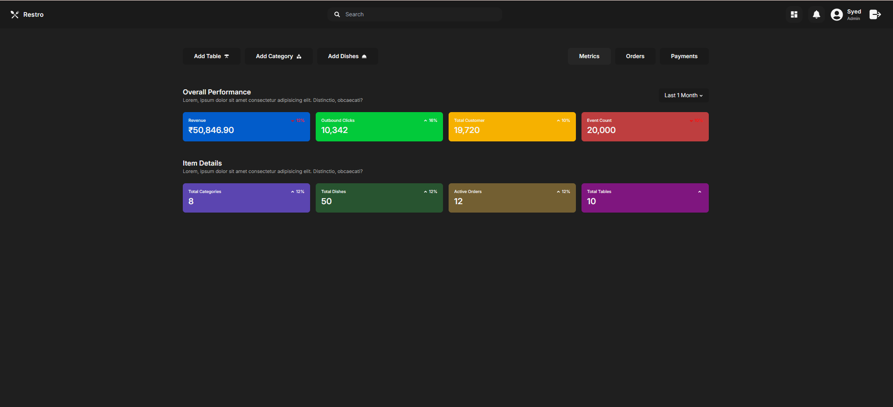
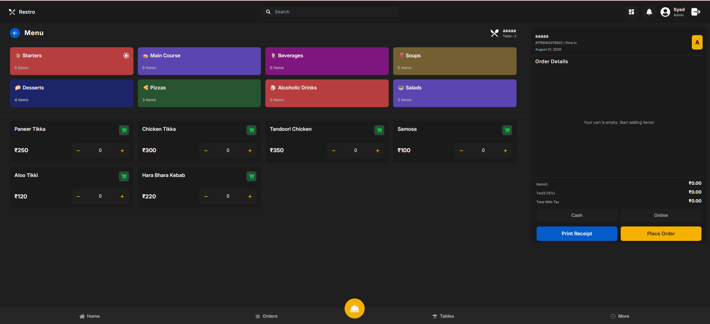
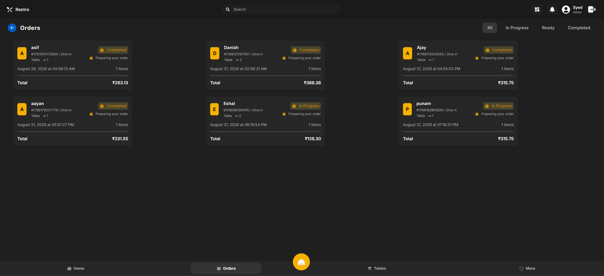
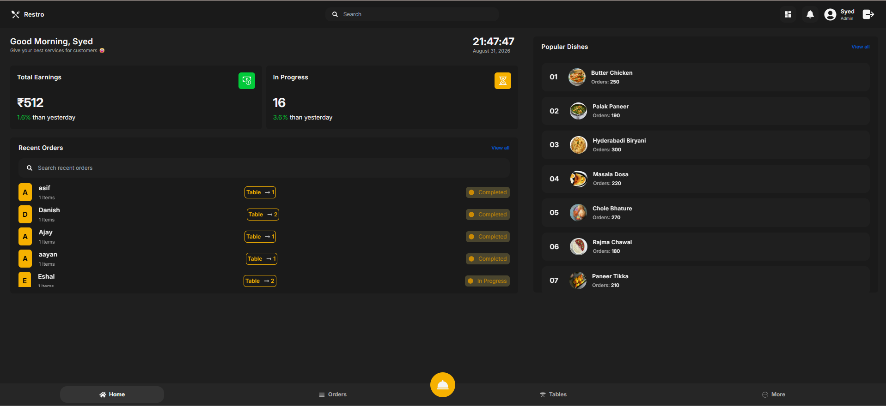

# 🍽️ Restaurant POS System

A full-stack **Restaurant Point of Sale (POS) System** built with the **MERN Stack** to streamline restaurant operations, including table management, order processing, billing, and online payments.

## ✨ Features

- 🔐 **Authentication** – Secure registration and login using JWT and bcrypt.
- 🪑 **Table Management** – Add tables, check availability, book tables, and automatically release tables after order completion.
- 🍛 **Menu & Cart** – Browse dishes, add items to cart, manage quantities, and calculate bills.
- 📋 **Order Management** – Create orders and track status from **In Progress → Ready → Completed**.
- 🧾 **Billing & Invoice** – Automatic tax calculation, billing, and invoice generation.
- 💵 **Cash Payment** – Support for cash payments.
- 💳 **Razorpay Payment** – Online payment integration with Razorpay payment verification.
- 🔔 **Razorpay Webhook** – Secure webhook signature verification and payment processing.
- 📊 **Dashboard** – View metrics, recent orders, and payment history.

## 🛠️ Tech Stack

| Category | Technologies |
|---|---|
| Frontend | React.js, Vite |
| Styling | Tailwind CSS |
| State Management | Redux Toolkit |
| Data Fetching | TanStack React Query |
| Backend | Node.js, Express.js |
| Database | MongoDB, Mongoose |
| Authentication | JWT, bcrypt |
| Payment Gateway | Razorpay |
| API | REST APIs |
| HTTP Client | Axios |
| Notifications | Notistack |
| Icons | React Icons |

## 🖼️ Screenshots

## 🖼️ Screenshots

<table>
  <tr>
    <td></td>
    <td></td>
  </tr>
  <tr>
    <td></td>
    <td></td>
  </tr>
</table>

## 🔄 Application Flow

    Login / Register
           ↓
    Restaurant Tables
           ↓
    Select Available Table
           ↓
    Browse Menu
           ↓
    Add Items to Cart
           ↓
    Enter Customer Details
           ↓
    Select Payment Method
           ↓
    Create Order
           ↓
    Table → Booked
           ↓
    Order Status
    In Progress → Ready → Completed
           ↓
    Table → Available

### Backend Setup

cd pos-backend
npm install
npm run dev

Backend runs on: http://localhost:8000

### Frontend Setup

Open another terminal:

cd pos-frontend
npm install
npm run dev

Frontend runs on: http://localhost:5173

## 🏗️ Project Structure

    Restaurant_POS_System/
    │
    ├── pos-backend/
    │   ├── config/
    │   ├── controllers/
    │   ├── middlewares/
    │   ├── models/
    │   ├── routes/
    │   ├── app.js
    │   └── package.json
    │
    ├── pos-frontend/
    │   ├── public/
    │   ├── src/
    │   │   ├── assets/
    │   │   ├── components/
    │   │   ├── hooks/
    │   │   ├── https/
    │   │   ├── pages/
    │   │   ├── redux/
    │   │   ├── constants/
    │   │   └── utils/
    │   ├── package.json
    │   └── vite.config.js
    │
    └── README.md

⭐ If you find this project useful, feel free to explore the repository.